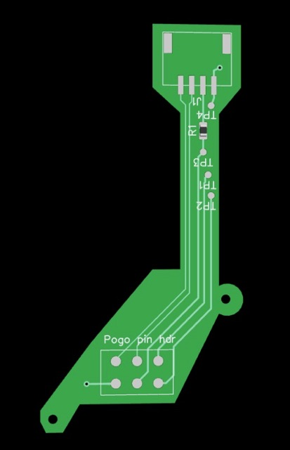
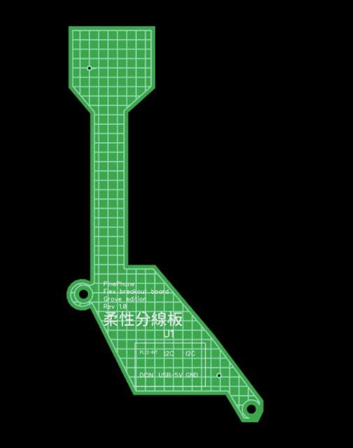
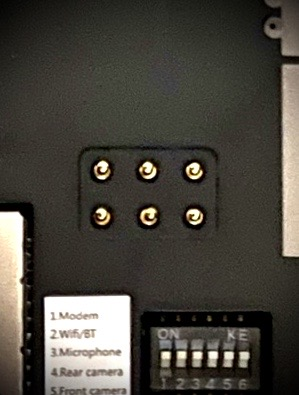
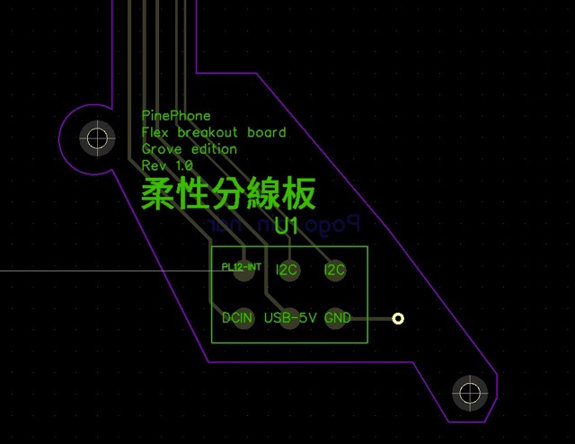
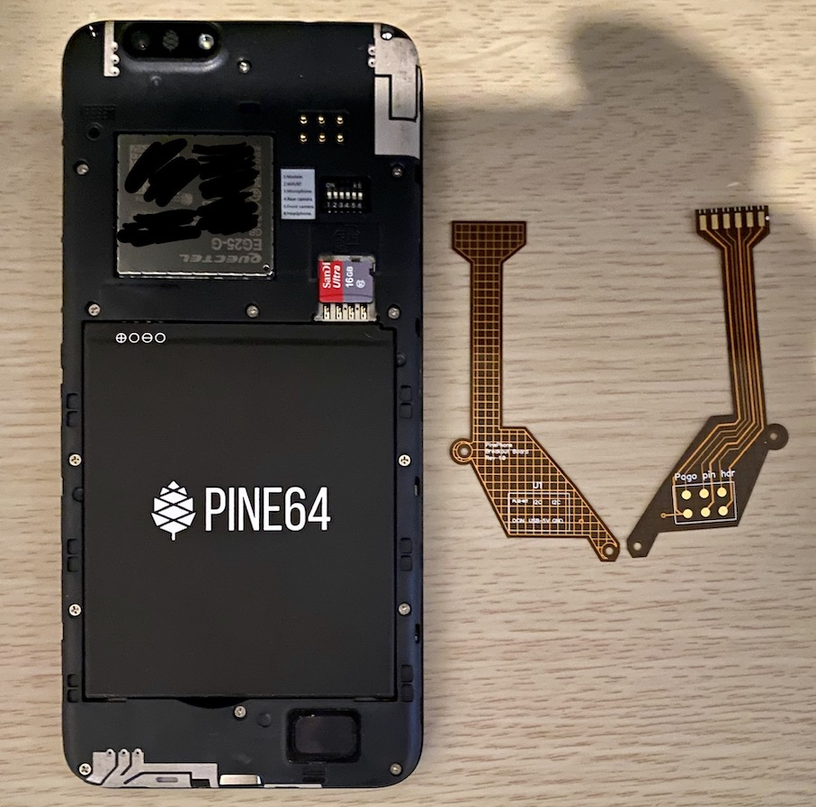
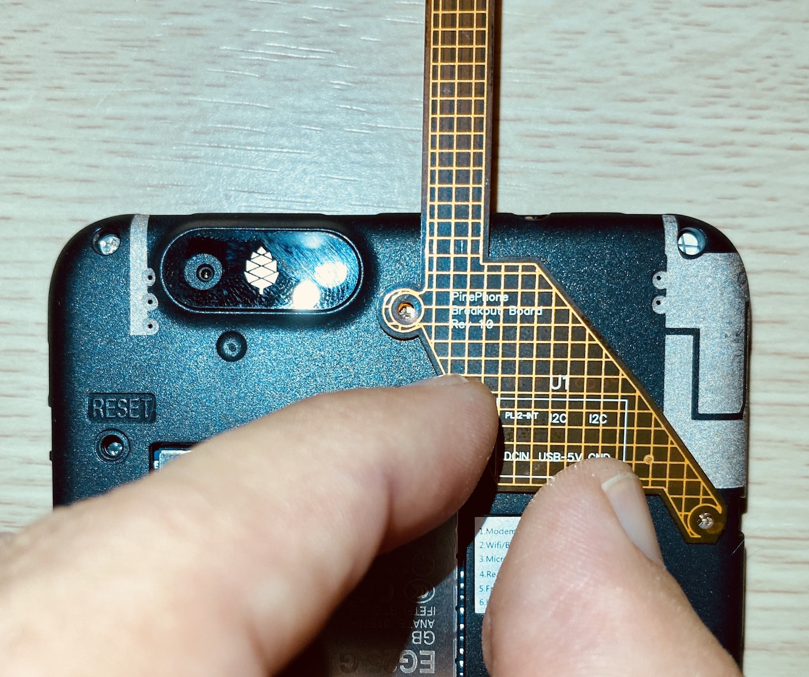
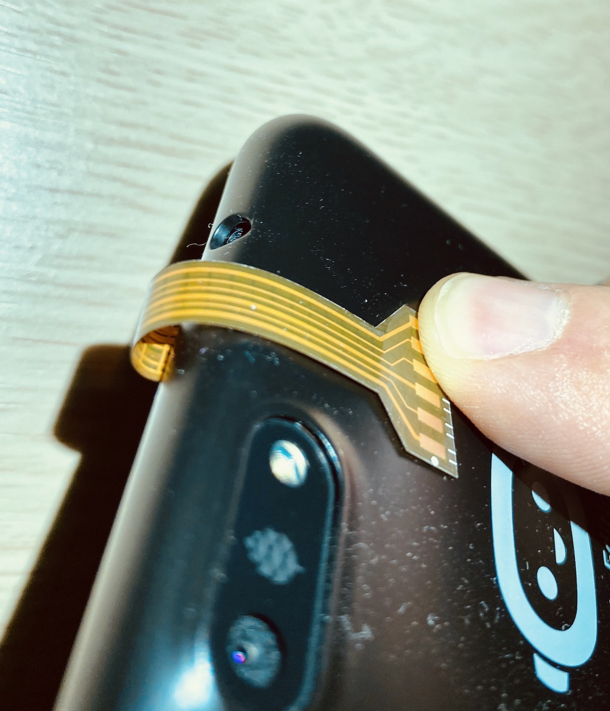

# pinephone_flex_breakout_board_grove
## Flex PCB breakout board for the PinePhone from Pine64 with Grove header
The PinePhone is an smart phone that supports the major Linux for mobile distributions. [Pine64 - PinePhone](https://www.pine64.org/pinephone/)

This project is a flex breakout board that exposes the power and I2C port on the pogo pins of the PinePhone onto a 4 pin Grove female header. 

Based on this other [project](https://github.com/jnavarro7/pinephone_flex_breakout_board) that can be purchased [here](https://pine64.com/product/pinephone-flex-break-out-board/))

The PinePhone exposes power, an interrupt pin and an I2C port on the back of it. 
This Flex board was designed to be able to expose these pins outside of the PinePhone with even the back cover on. 

## Grove female header version

## Pogo Pins
The way the PinePhone exposes power, interrupt and I2C port is via a set of 6 pogo pins that stick out on the back of the PinePhone. 

## Pogo Pins Pinout
The schematic from Pine64 is not very clear and does not states which I2C pin is which so this is still to be confirmed.  Once I know which is DATA and which is CLK I will update the design. 

## Mounting of this flex board

The flex board is meant to be mounted with screws using the ones already available in the PinePhone but longer screws will be needed to make a better attachment, Pine64 already sells these along with the other version of the flex breakout board. 

Once protototype of this new grove version arrive I will update the pictures. 

## Design

The design was created using <a href="https://diptrace.com" title="DipTrace">DipTrace</a>

Remember to order it as a Flex Board!. 

## Order from OSHPark

<a href="https://oshpark.com/shared_projects/7gIMIkNa"></img></a>

## License

Released under the Creative Commons Attribution 3.0 License
https://creativecommons.org/licenses/by/3.0/